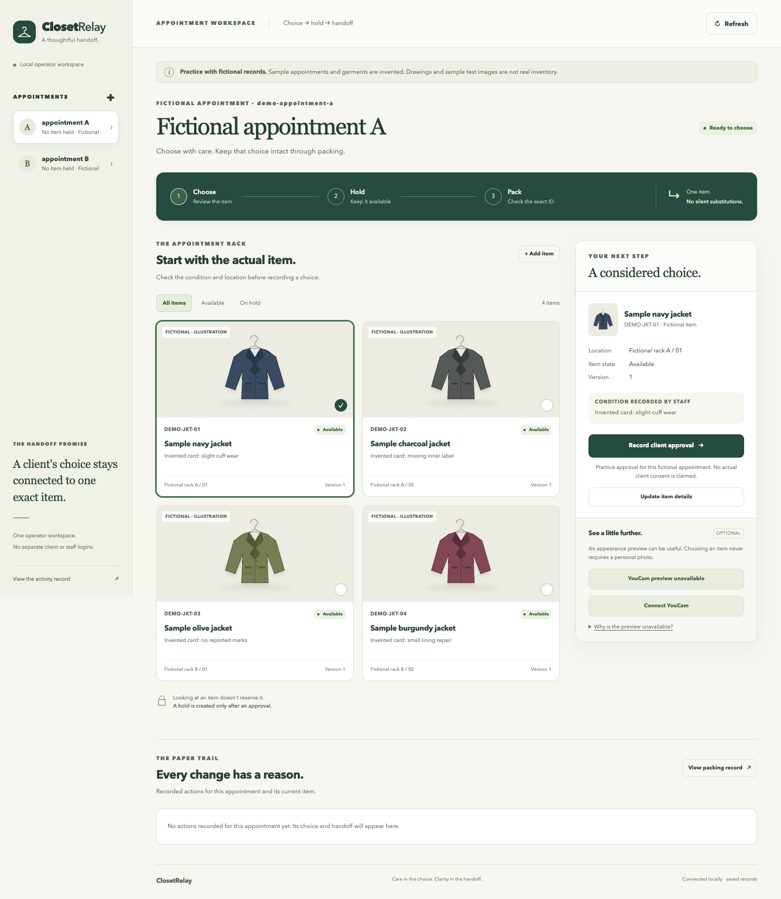

# ClosetRelay

Carry one recorded clothing choice through an exclusive hold and an exact-item packing handoff.

ClosetRelay is a working **local, single-operator prototype** for a remote career-clothing appointment workflow. It joins a specific garment card, the recorded client choice, inventory reservation, and packing evidence. It refuses silent substitutions and stale approvals. The interface can record consent and upload images for an optional YouCam Clothes V4 appearance preview.

**Current provider status: real integration code is implemented, but a successful live YouCam request has not been verified.** A missing key disables previews. Offline tests use explicit test doubles; their results are not provider inference. The included portrait and jacket are clearly disclosed synthetic test inputs.

[Watch the 88-second local prototype demo](artifacts/closetrelay-local-prototype.mp4) · [Transcript](artifacts/closetrelay-local-prototype.srt) · [Independent media review](artifacts/recording/FINAL_REVIEW.md)



## Try it

Use Python 3.12 or later. The app and provider adapter use the standard library and need no package installation.

```sh
python3 -B -m backend.server
```

Open <http://127.0.0.1:4323>. The first run creates a persistent SQLite database with four fictional garment cards and two fictional appointments. Refreshing or restarting does not reset the records.

1. Record a choice of an available item for an appointment.
2. Create a hold for that current approval.
3. Confirm the exact item ID at packing. A different ID is refused.
4. Inspect the packing record and activity history.

Use the second appointment to test shared stock. An inventory change or released hold requires a new review; an old approval cannot silently reclaim the garment. The complete selection and packing route works without a portrait or AI preview.

For a fresh empty workspace, use a new database path:

```sh
python3 -B -m backend.server --empty --database backend/data/my-workspace.sqlite3
```

This server binds only to the loopback interface. The workspace has **no separate client/staff authentication**; the operator controls every appointment. Do not expose it publicly or use it as a production service for client data. The design for a remote service requires authenticated assignment, access controls, operations, and a reviewed retention policy.

## Optional provider connection

The UI accepts a YouCam API key for the current server process only. The key is not returned to the browser, written to the database, or included in logs. Restarting disconnects it; startup does not read an ambient environment key. Never put a key in source, a screenshot, or a public demo.

Upload a source image for the appointment and a reference photograph for the garment, record processing consent, and request a preview. For a disclosed synthetic demonstration, use the images in [demo-assets](demo-assets/README.md). Only a valid provider success can produce a result image. A preview illustrates appearance, not physical fit, condition, measurements, or suitability for a job.

Changing the choice, garment, source image, or consent invalidates the old result. Withdrawing consent stops further local display and processing and removes local personal media records. This is not a guarantee of forensic erasure or removal from backups. **Upstream cancellation/deletion is not implemented or verified.** The [provider privacy policy](https://www.perfectcorp.com/perfectbeauty/youcam/privacy-policy-api) governs provider retention.

Read [provider details](PROVIDER.md), [backend behavior](BACKEND.md), and [UI checks](UI.md) for the actual implementation and limits.

## Verification

```sh
python3 -B -m unittest discover -s provider-tests -v
python3 -B -m unittest discover -s backend-tests -v
```

[QA evidence](docs/QA.md) records the checks actually executed, observed defects, and remaining gaps. Passing simulated state/transport tests does not establish a successful live integration, real client benefit, or an advantage over another product.

## Why this project

Existing career-clothing programs already serve remote clients. Shared styling products and inventory systems are capable alternatives. Our hypothesis is that connecting one voluntary choice to the same physical item at packing could reduce coordination work. That hypothesis remains unproven; catalog preparation and existing workflows are part of the comparison. Read the [research and challenge](docs/RESEARCH.md).

## Hackathon status and provenance

The target is the [YouCam API Skin AI + Ecommerce Hackathon](https://youcam-api-skin-ai-ecommerce.devpost.com/rules). This September 26, 2026 prototype predates the September 29 submission period. Its dated history is preserved; eligibility of an eventual existing-project entry requires significant updates during the permitted period and accurate disclosure of prior work. This repository is **not evidence of a submitted entry**.

Codex and collaborating AI agents researched, implemented, generated the two disclosed test images, and tested the project under the operator's direction. No client interviews, charity partnership, adoption, productivity improvement, fit accuracy, or winning probability is claimed. [Submission draft](docs/SUBMISSION.md).

MIT-licensed source. Provider services, policies, and third-party materials retain their own terms. No private database, real client photograph, or API key is part of this repository.
